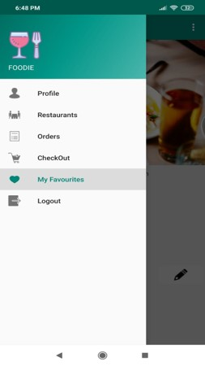
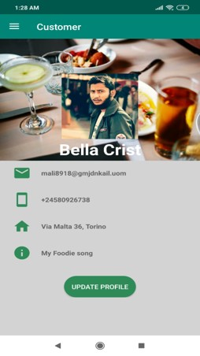
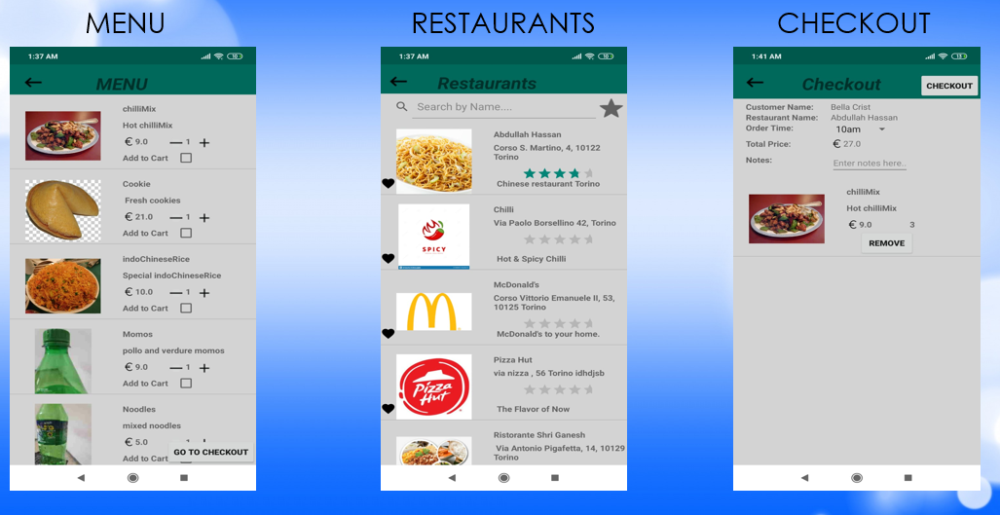

# customer_notify
This app is one module of a Food Delivery Project. This app is for the Customer to place an order, 
who can choose different items from a restaurant. After an order is placed, a ntofication is sent to the Restaurant Manager App. 

Below are the screenshots of menu and profile page of delivery app:

                
 
Google Firebase Console was used to store the data. 
Below are other activity pages of Customer app:

